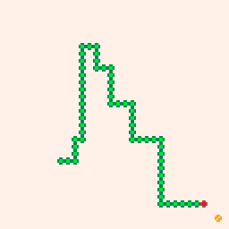
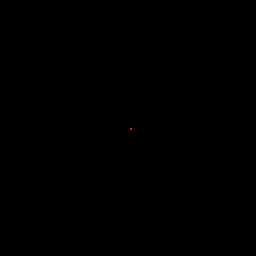
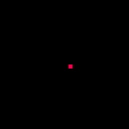
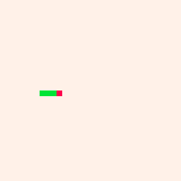

# Oppgave 2 (Snake)

I denne oppgaven skal vi implementere et spill bit for bit.

Spillet vi har valgt er klassikeren "Snake" som de fleste sikkert har spilt. Kort sagt er spillets regler omtrent slik:
- Man styrer en orm som hele tiden beveger seg fremover i en konstant hastighet.
- Man kan endre retningen ormen beveger seg i, men kun i 4 retninger (opp,ned,venstr,høyre). 
- Mat blir lagt ut på tilfeldige steder på skjermen
- Dersom man styrer ormen frem til maten vil den vokse seg lengre og man tjener flere poeng. 
- Ormen dør dersom den kolliderer med veggene i brettet eller sin egen kropp.

Det ferdige spillet vil se omtrent slik ut:



Vi starter med å sette opp funksjonene i gameloopen som diskutert i forrige oppgave:

```lua
function _init()
end

function _update()
end

function _draw()
end
```

lagre dette til en ny fil:

```
save oppgave2.p8
```
# Del 1 - animasjon

Det første vi trenger er en måte å flytte slangens hode fremover automatisk. Vi må også ha en må_te å tegne hodet, slik at vi kan se at flyttingen virker.

I første omgang vil vi at slangen er representert kun med hodet, og dette skal være 1 piksel bredt og høyt.
1. Utvid funksjonen `_init()` til å sette en initiell posisjon (`x` og `y`) til slangens hode
1. Utvid funksjonen `_update()` til å holde styr på hodets posisjon, og la denne posisjonen flytte seg mot høyre for hver gang funksjonen kalles.
    - Merk koordinatsystemet i PICO-8:
    - X-aksen går fra 0 til venstre på skjermen og til 127 helt til høyre
    - Y-aksen går fra 0 øverst på skjermen til 127 nederst

2. Utvid funksjonen `_draw()` til å tegne en representasjon av slangehodet.
    - Her vil du mest sannsynlig trenge funksjonen `pset(x,y,color)`

Resultatet bør se noe slik ut:



<details>
<summary>Løsningsforslag del 1</summary>

```lua
function _init()
    -- Starter midt på skjermen
	x = 64
	y = 64
end

function _update()
    -- Øker x-koordinatet med 1
	x += 1
end	

function _draw()
    -- Tømme skjermen
    cls(0) 
    --Tegne rød piksel på gitt posisjon
	pset(x,y,8) 
end
```

</details>

# Del 2 - celler / rutenett

Dette ble litt smått, la oss skalere det opp litt.

Vi deler opp spillebrettet i 32x32 ruter, hver av disse er da 4 piksler i hver retning. Rute 0,0 ligger øverst til venstre, rute 31,31 ligger nederst til høyre.

TIPS: Om du tar vare på rutestørrelsen i en egen variabel (f.eks `cellsize`) er det lett å endre den senere. Antal ruter kan beregnes etter
`numcells = ceil(128 / cellsize)`

For å holde styr på slangens posisjon holder det at vi forholder oss til det nye rutenettet, men for opptegningen må vi oversette mellom rutekoordinater og skjermkoordinater. Her kan øvre venstre hjørne på cellen i skjermkoordinater finnes vha formelene 
`screenx = x * cellsize` og `screeny = y * cellsize`.

Selve opptegningen må også oppdateres, her kan du f.eks bruke funksjonen `rectfill(x1,y1,x2,y2,color)` evt `circfill(x,y,radius, color)`.

For at slangen ikke skal forsvinne så raskt ut fra skjermen skrur vi også ned hastigheten på simuleringen ved at vi bare oppdaterer status hver fjerde frame. Her er modulus-operatoren (`a % b`) veldig kjekk.

Når dette er på plass bør resultatet likne på dette:



TIPS: Dersom du er usikker på om hodet til slangen er tegnet på rett koordinat eller med riktig størrelse kan denne lille snutten legges inn i `_draw()` for å tegne opp rutenettet:

```lua
    for x = 0,31 do
        for y = 0,31 do
            pset(x*cellsize,y*cellsize,7)
        end
    end
```
<details>
<summary>Løsningsforslag del 2</summary>

```lua
--disse innstillingene styrer skaleringen av spillet
cellsize = 4
boardsize = 128 / cellsize

function _init()
	t = 0
	x = boardsize / 2
	y = boardsize / 2
end

function _update()
    t += 1

    -- Vi vil bare oppdatere posisjonen hver cellsize frame. 
    -- Dette oppnår vi ved å sjekke restverdien fra å dele t på cellsize.
    -- Restverdien vil nemlig være 0 hver cellsize frame
    if t % cellsize != 0 then 
        return 
    end

    --vi oppdaterer fortsatt bare verdien med 1, men 1 betyr nå 1 celle, ikke 1 piksel:
	x += 1 
end	

function _draw()
    cls(0)
    -- her må vi gange opp koordinatene med cellsize 
    -- for å gå fra cellekoordinater til skjermkoordinater:
    rectfill(x * cellsize, y * cellsize, (x + 1) * cellsize - 1, (y + 1) * cellsize - 1, 8)
end 
```
</details>

## Del 3 - input

Nå som slangehodet tegnes riktig i det nye rutenettet skal vi legge inn mulighet for å styre det. Vi vil dermed sjekke i `_update()` om retningsknappene er trykket ned, og dersom de er det endre retningen slangen skal bevege seg i. En grei måte å gjøre dette er å dele opp retningen i x- og y- komponent slik at man har variablene `dirx` og `diry`. Hver av disse kan ha verdiene -1,0 eller 1 avhengig av retningen man beveger seg i. Oppdateringen av posisjonen kan da gjøres per komponent også:

```lua
x += dirx
y += diry
```

For å sjekke om en knapp har blitt trykket ned siden sist kan man bruke funksjonen `btnp(buttonid)`. Som buttonid kan man enten sende inn tallverdier eller spesielle symboler (emojis) som representerer retningene og knappene. I PICO-8-editoren finner man retning-emojiene på shift-u (up), shift-d (down), shift-l (left) og shift-r (right). I tillegg finnes shift-x og shift-z som representerer de to knappene på kontrolleren. Om man sitter i en ekstern editor kan man prøve å lime inn en av disse (fungerer i visual studio code på windows):

⬆️⬇️⬅️➡️

* Merk: Det kan være smart å skille mellom hvilken retning slangen beveget seg i forrige steg og hvilken vei den skal bevege seg i neste steg. Dette fordi vi vil gjøre det mulig å ombestemme seg inntil neste flytt, og samtidig vil vi at det skal være umulig å snu 180 grader i samme flytt, for da havner vi jo inn i vår egen hale.

I tillegg vil vi gjøre det slik at om slangen beveger seg utenfor brettet så fortsetter den på andre siden, slik at vi slipper å starte på nytt hver gang vi havner utenfor. Her kan på nytt modulo-operatoren `%` komme til nytte.

Med dette på plass bør resultatet se noe slikt ut:


<details>
<summary>Løsningsforslag del 3</summary>

```lua
cellsize = 4
boardsize = 128 / cellsize

function _init()
	t = 0
	x = boardsize / 2
    y = boardsize / 2
    -- initiell retning:
	dirx = 1
    diry = 0
    movingx = dirx
    movingy = diry
end

function checkinput()
    -- endre (neste) retning avhengig av knappen som ble trykket ned
    -- merk sjekkene mot moving[x|y] der vi sjekker at man ikke snur
    -- 180 grader i samme flytt
    if btn(⬆️) and movingy != 1 then
        diry = -1
        dirx = 0
    elseif btn(⬇️) and movingy != -1 then
        diry = 1
        dirx = 0
    elseif btn(⬅️) and movingx != 1 then
        dirx = -1
        diry = 0
    elseif btn(➡️) and movingx != -1 then
        dirx = 1
        diry = 0
    end
end		

function move()
    -- oppdatere x- og y-posisjon, ta høyde for 
    -- at man beveger seg ut av brettet og inn på andre siden:
	x = (x + dirx) % boardsize
    y = (y + diry) % boardsize
    -- lagre unna retningen for forrige flytt slik at vi kan sjekke mot det i checkinput()
	movingx = dirx
	movingy = diry
end

function _update()
    t += 1
    -- vi sjekker input for hver frame selv om vi ikke oppdaterer 
    -- posisjonen så ofte, dette så vi ikke går glipp av tastetrykk:
	checkinput()
	if t % cellsize != 0 then return end
	move()
end	

function _draw()
	cls(0)
	rectfill(x*cellsize,y*cellsize,(x+1) * cellsize - 1, (y + 1) * cellsize - 1, 8)
end
```
</details>

## Del 4 - halen

Nå som vi kan styre slangens hode rundt på brettet skal vi legge på en hale på slangen. Halen skal følge etter hodet slik at alle cellene hodet har vært innom skal berøres av halen ettersom den beveger seg over brettet.

Det finnes flere måter å holde styr på dette, men vi har for for denne oppgaven valgt å holde på alle halens segmenter i en sekvens (en spesiell form for lua-tabell der elementene ikke har en eksplisitt nøkkel / key). Når hodet flytter seg legger vi til den nye posisjonen i sekvensen, og fjerner deretter de eldste posisjonene inntil halen har riktig lengde.

For å opprette en tom sekvens kan man bruke syntakset
```lua
tail = {}
```

API-funksjonene `add(tail, element)` og `remove(tail,element)` kan så brukes for å manipulere sekvensen. For å finne lengden på sekvensen kan man bruke syntakset `#tail`.

* MERK: Lua-sekvenser starter nummereringen fra 1 og ikke 0!

La slangen starte med en initiell lengde på 3, men med en tom sekvens. Skriv logikken som gjør at halen flytter seg etter hodet på spillebrettet. 

Legg også inn funksjonalitet i `_draw()` som tegner halen etter at hodet har blitt tegnet. Det kan være greit å splitte ut tegning av hhv hode og hale i egne funksjoner.

Endre gjerne også bakgrunnsfargen i kallet til `cls(color)` til noe annet enn sort. 

Med dette på plass bør resultatet se omtrent slik ut:



<details>
<summary>Løsningsforslag del 4</summary>

```lua
--init
cellsize = 4
boardsize = 128 / cellsize

function _init()
	t = 0	
	x = boardsize / 2
	y = boardsize / 2
	dirx = 1
	diry = 0
	movingx = dirx
    movingy = diry
    
    --vi starter med en tom hale-sekvens og en lengde på 3
	tail = {}
	length = 3
end


-->8
--update
function checkinput()
	if btn(⬆️) and movingy != 1 then
		diry = -1
		dirx = 0
	elseif btn(⬇️) and movingy != -1 then
		diry = 1
		dirx = 0
	elseif btn(⬅️) and movingx != 1 then
		dirx = -1
		diry = 0
	elseif btn(➡️) and movingx != -1 then
		dirx = 1
		diry = 0
	end
end		

function move()
    -- legg til forrige posisjon i halen
    add(tail, {x = x, y = y})
    -- og fjerne eventuelle gamle posisjoner fra halen til den har riktig lengde
	while #tail > length do
		del(tail, tail[1])
	end

	x = (x + dirx) % boardsize
	y = (y + diry) % boardsize
	movingx = dirx
	movingy = diry	
end

function _update()
	t += 1
	checkinput()
	if t % cellsize != 0 then 
		return
	end
	move()
end	

-->8
--draw

function drawhead()
	drawsegment(x, y, 8)
end

function drawtail()
	for segment in all(tail) do
		drawsegment(segment.x, segment.y, 11)
	end
end

function drawsegment(x, y, color)
    -- her har vi abstrahert bort tegning av et segment 
    -- slik at samme kode kan brukes både fra drawhead og drawtail
	rectfill(x * cellsize, 
		y * cellsize,
		(x + 1) * cellsize - 1, 
		(y + 1) * cellsize - 1, 
		color)
end

function _draw()
	cls(7)
	drawhead()
	drawtail()
end

```
</details>
