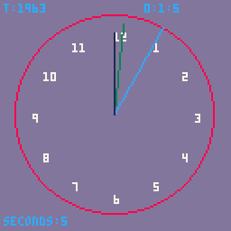
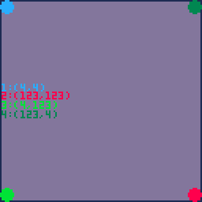

% metatables og coroutines
% 1. November, 2019

# tid
{ width=40% heigth=40% }

# 
::: nonincremental
- pico-8 bruker et subsett av Lua 
- tabeller til Lua er som lister til Lisp
- med tabeller lager vi andre datastrukturer(og objekter)
:::

# tabeller
::: nonincremental
```{.lua .numberLines}
local a_table = {}
local an_table = {1,2,3,4}
an_table[1] == 1 -- sant, i Lua starter indekser fra 1
an_table[-1] == nil -- sant

a_table.func = function(echo) return echo end

a_table.func == a_table["func"]
a_table:func() -- a_table.func(a_table)

local table_as_map = {key = "value"}
table.key == "value"
```
:::

# metatable
::: nonincremental
- er en tabell mt = {}
- omdefinerer vanlige operasjoner +-/*[]()
- beskriver hva som skal skje når nøkler ikke finnes i tabellen 
- lar oss bruke objekter på lignede måte som i javascript
:::

# indeks
::: nonincremental
```{.lua .numberLines}
vec = {x = 0, y = 0, __index=?}
-- vec[z] ?
-- er en func => vec.__index(t, z) 
-- er en annen tabell => vec.__index[z]
```
:::

# eksempel
```{.lua .numberLines}
vec = {x = 0, y = 0}
function vec:new(x, y)
  self.__index = self
  return setmetatable({x=x, y=y}, vec)
end

function vec.__add(a, b)
    if type(a) == "number" then
        return vec:new(a + b.x, a + b.y)
    end
    if type(b) == "number" then
     return vec:new(a.x + b, a.y + b)
    end
    return vec:new(a.x + b.x, a.y + b.y)
end
```

# 
```{.lua .numberLines}
a = vec:new(1, 0)
b = vec:new(0, 1)

c = a + b
-- c er vec:new(1, 1)
```

# coroutines
{ width=40% heigth=40% }

# coroutines
::: nonincremental
```{.lua .numberLines}
function anim()
  for i=4,123,1 do
    x=i
    y=i
    yield()
  end
end
if (cor == nil) cor = cocreate(anim)

if cor and costatus(cor) != 'dead' then
    coresume(cor)
else
    cor = nil
end
```
:::

# links
::: nonincremental
- <http://lua-users.org/wiki/MetamethodsTutorial>
- <http://lua-users.org/wiki/MetatableEvents>
- <https://www.lua.org/pil/16.html>
- <https://pico-8.fandom.com/wiki/APIReference>
- <http://lua.space/general/intro-to-metatables>
- <https://www.lexaloffle.com/bbs/?tid=3342>
- <https://pico-8.fandom.com/wiki/Tables>
:::
